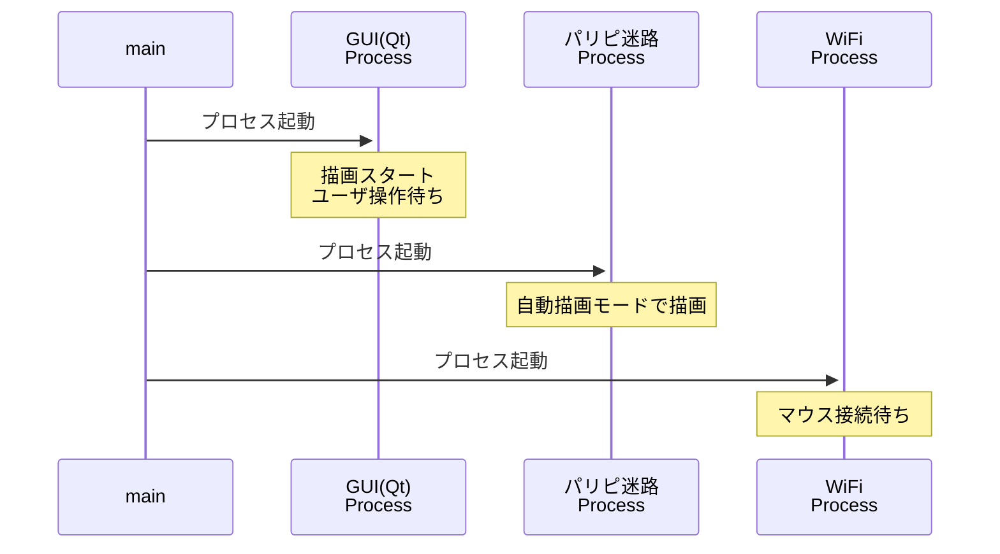
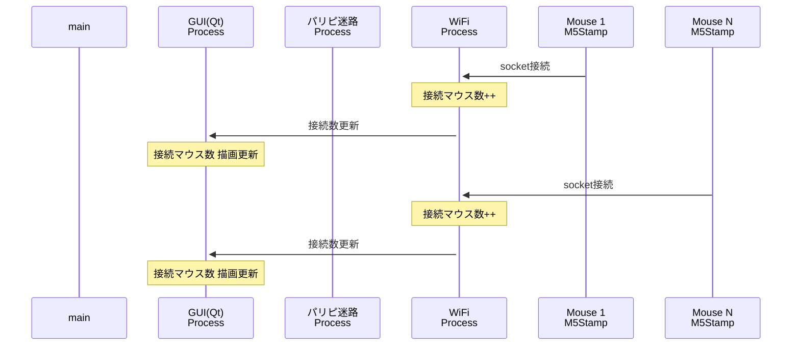
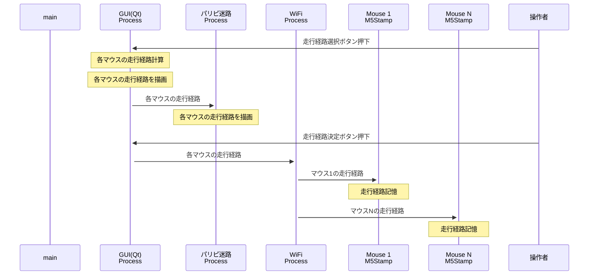
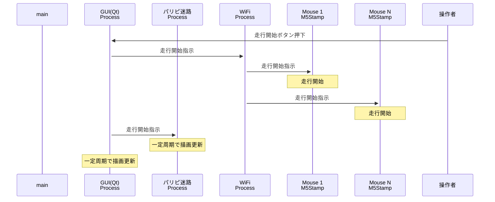
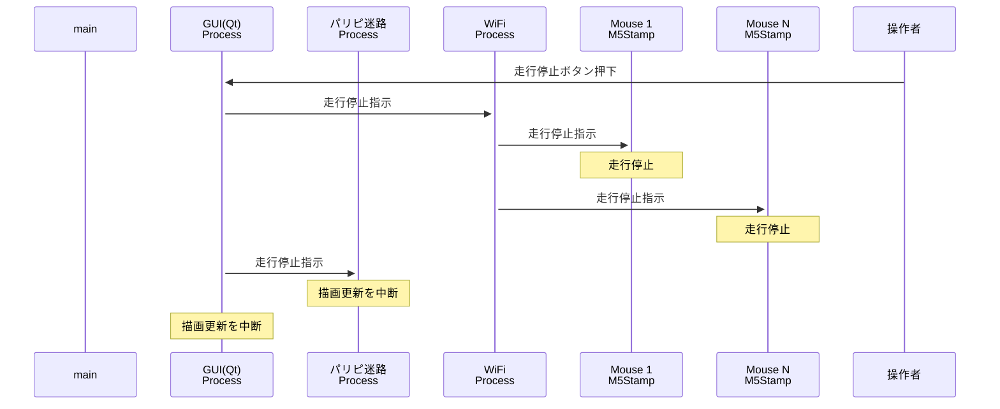

# ⚡️電光石火⭐︎ぴかぴかクリーナーズ

#### 起動時処理(プロセス起動)

#### マウスWiFi接続
目的：
- システムに接続しているマウスの数をGUIで表示する
- 経路計算で必要なマウスの数を経路計算を行うGUIプロセスへ通知する

#### 経路選択ボタン/経路決定ボタン押下
目的：
- ユーザに経路を選択させる（連続して押下した場合は前回値はリセットする）

（Want: ユーザに自由に経路引かせられたら楽しいかも。）

#### 走行開始ボタン押下
目的：
- 走行開始ボタン押下で、掃除を開始する
- 走行中の

走行停止ボタンも同様の流れ。

#### 走行停止ボタン押下
目的：
- 走行中のマウスを止める

